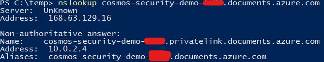

# Azure Cosmos DB - Security

This repository contains sample configuration scripts (Terraform and more to come) how to deploy a hardened Cosmos DB and uses a Python script to test.

## Resources created

1. Resource group
2. Azure Cosmos DB
3. Managed identity
4. Azure Key Vault
5. Azure Log Analytics workspace
6. Private DNS Zone
7. Azure Virtual Network
8. Windows 11 VM (with public ip)

## Cosmos features enabled

1. Customer Managed Key for encryption at rest
2. Disabled key authentication
3. Disabled public endpoint
4. Disabled access key metadata writes
5. TLS 1.2
6. Private endpoint
7. Continuous backup
8. Enable Diagnostics full-text query
9. Enable Diagnostic Settings (ControlPlaneRequests, DataPlaneRequests, QueryRuntimeStatistics)

## Terraform

1. Clone the repo

    ```powershell
    git clone https://github.com/fonsecamar/cosmos-security.git
    cd cosmos-security/terraform
    ```

2. Provision infrastructure (review terraform plan and type 'yes' to approve)

    ```
    az login
    ./terraform.exe init
    ./terraform.exe apply
    ```

## Testing connectivity

2. Connect to your VM using RDP

3. Test private ip resolution

    ```powershell
    nslookup cosmos-security-demo-<sufix>.documents.azure.com
    ```

    

4. Install Python3 (https://www.python.org/downloads/windows/)

5. Copy sample.py to the VM

6. Run the commands below to install dependencies

    ```python
    pip install azure-cosmos
    pip install azure-identity
    ```

7. Set your Cosmos endpoit and run the python script which will use VM managed identity to connect to Cosmos DB

    ```powershell
    $env:COSMOS_ENDPOINT="https://cosmos-security-demo-<sufix>.documents.azure.com:443/"
    python3 .\sample.py
    ```

You should see the results of Point Read and Query operations.

## How to Contribute

If you find any errors or have suggestions for changes, please be part of this project!

1. Create your branch: `git checkout -b my-new-feature`
2. Add your changes: `git add .`
3. Commit your changes: `git commit -m '<message>'`
4. Push your branch to Github: `git push origin my-new-feature`
5. Create a new Pull Request 😄